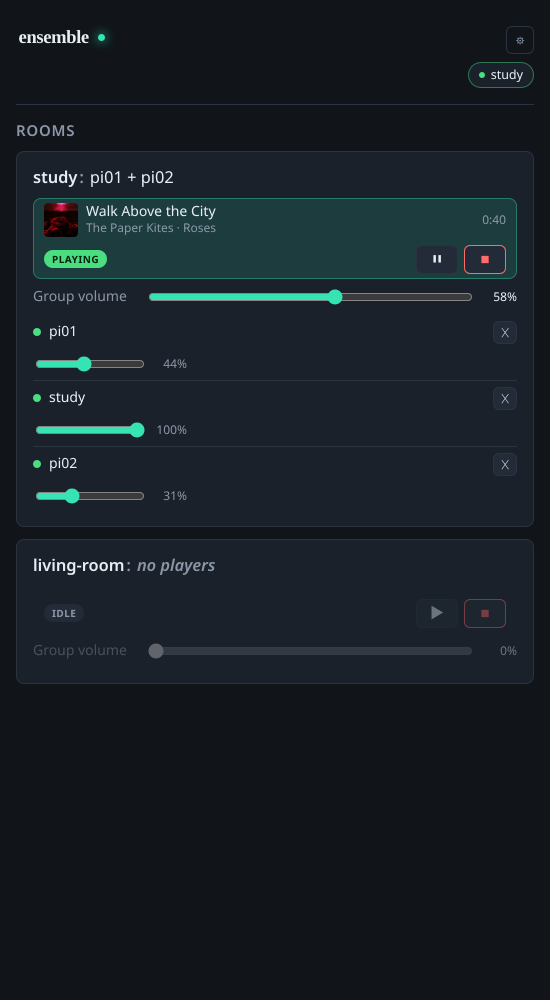
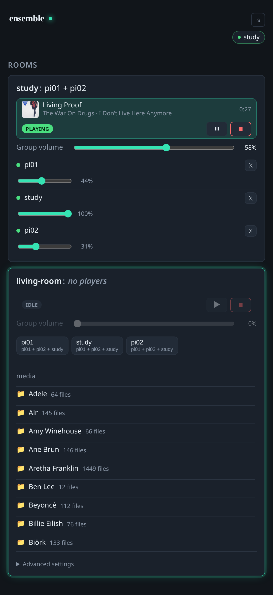
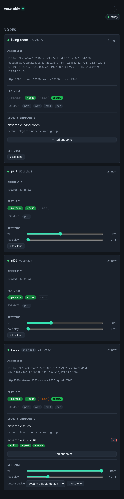
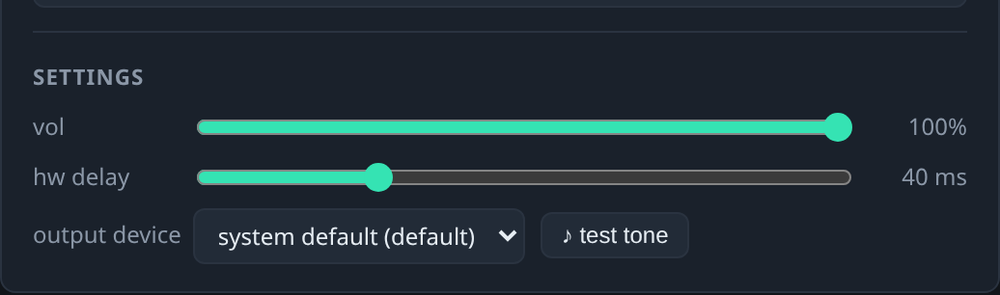
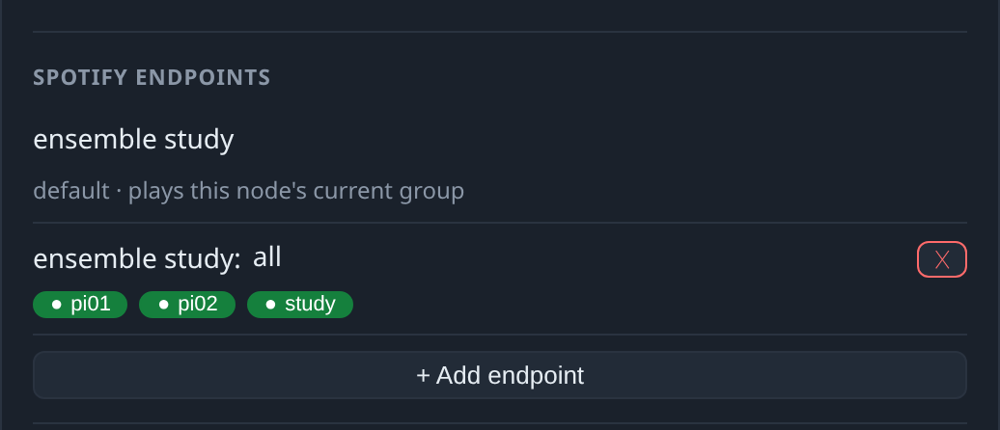

# Ensemble — UI Reference

> **You are here:** [User Guide](README.md) › **UI Reference**
> New to ensemble? Start with the [overview and setup scenarios](README.md). This
> page is the screen-by-screen reference for the web app — where every control
> lives and what it does.

Ensemble turns the speakers around your home into synchronized, groupable rooms
you control from a phone or browser. This page walks through the web UI.

> **One app, every node.** Every ensemble node serves the *same* web app and
> proxies to the others, so it doesn't matter which node's address you open
> (`http://<any-node-ip>:8080`). There are two pages: the **Rooms** overview
> (landing page) and the **Nodes** page (the **⚙ gear**, top-right). The pill
> next to the gear shows this node's name and the live-connection state (green =
> connected, amber = reconnecting/stale, red = disconnected).

---

## The Rooms page (overview)

Each card is a **room group** — one master node plus any players following it. The
card title is the group's label: an explicit name, or a derived one like
**`study: pi01 + pi02`** (master, then its players). A solo node is its own group.

**Now-playing bar** (when something is playing):
- **Cover art + title + artist · album** of the current track (from Spotify, or the
  file name for local files). Line-in shows no track info.
- The elapsed **position**, a **state pill** (`playing` / `paused` / `idle`), and
  **⏸ pause/▶ resume** + **■ stop** controls for the whole group.

**Volumes:**
- **Group volume** scales every member proportionally (shown for multi-member
  groups).
- Each **member row** has the node's own live volume slider, and a **✕** to remove
  it from the room. The master is marked with a **master** badge; the node you
  opened the app on is marked **this node**. On the master, source stats (e.g.
  *2 listeners*) appear on their own line.

**Select a room** (tap/click its card) to reveal its operational controls — see
below. The selected card is outlined with the accent glow.

> On a narrow phone screen the rows reflow: the now-playing bar stacks into two
> rows, each member's volume slider drops below its name, and the badges/stats are
> hidden to keep things readable.

---

## Room controls (a selected room)

Selecting a room reveals three things under the member list:

1. **Add players** — a row of chips, one per playback-capable node not already in
   this room. Each chip shows where that node currently is (`idle`, or another
   group); tap it to pull the node into this room.
2. **Media** — browse the master's library. Folders are navigable (tap to enter,
   `..`/breadcrumbs to go back) and the list scrolls internally. **Play here**
   starts a track playing to the whole group — if the chosen node wasn't the
   group's master, mastership moves to it first. (There's also support for
   `http(s)://` streams and the node's line-in where enabled.)
3. **Advanced settings** (twirl-down, collapsed by default) — per-group **codec**
   (`pcm` / `opus`), **transport** (`udp` / `tcp`), and **buffer** (ms). On flaky
   Wi-Fi prefer **opus** (smaller packets). See the
   [Config Reference](config-reference.md#7-per-group-stream-settings) for what each
   knob trades off.

Rename a group by clicking its title; the name is tied to that *set of rooms* and
returns whenever they regroup.

---

## The Nodes page (⚙ gear)

Every known node gets a card, organized into labeled sections. The header shows
the node name (click to rename), its short ID, and live/last-seen status.

- **Addresses** — the node's network addresses and the ports it bound.
- **Features** — the operator-toggleable capabilities, each a tri-state chip:
  **● green = on**, **○ amber = off** (click to toggle), **✕ dimmed = unavailable**
  on that host. Nodes running go-librespot also show a green **`spotify`** badge.
- **Formats** — the media formats/codecs the node can decode (read-only).
- **Spotify endpoints** — Spotify Connect devices (see next section).
- **Settings** — playback knobs:

  - **vol** — the node's output volume.
  - **hw delay** — nudges this node's output earlier/later (0–150 ms) to align
    rooms perfectly; hovering the label explains it compensates fixed device
    latency. See [calibration](config-reference.md#hw-delay--alignment).
  - **output device** — the ALSA device picker (on hosts that have one).
  - **♪ test tone** — plays a short tone so you can identify/check a speaker.

---

## Spotify endpoints

On a node that runs go-librespot, the **Spotify endpoints** section manages the
Spotify Connect devices it advertises:

- **Default device** — `ensemble <node>` (read-only). Playing to it from the
  Spotify app plays to whatever group that node currently masters — the original
  behavior.
- **Presets** — add named endpoints (e.g. **`all`**). Each advertises its own
  Connect device, **`ensemble <node>: <name>`**, and carries a row of **player
  chips** (the playback-capable nodes); tap a chip to toggle a player in/out
  (**green = included**). When you pick that device in the Spotify app, the node
  **regroups to exactly those players, then plays**. Only the part after the colon
  is editable; **✕** removes the preset.

All endpoints are discoverable in the Spotify app at once, but **only one plays at
a time** per node — picking another preset (or the default) preempts the current
one and regroups. Renaming the node updates every device name automatically.

> Adding/removing presets and renaming take effect immediately (the matching
> go-librespot bridge starts/stops/re-advertises), so the device list in your
> Spotify app updates within a few seconds.

For how to get go-librespot onto a node in the first place, see
[Spotify Connect & podcasts](scenarios/nas-master.md#spotify-connect--podcasts).

---

## Tips

- **Which node do I open?** Any of them — the app is identical everywhere and
  proxies to the rest.
- **Grouping** is just "who follows whom": adding a player to a room makes it
  follow that room's master; removing it (**✕**) sets it solo. Stopping playback
  leaves the grouping intact.
- **Alignment** — if one room is slightly ahead/behind, nudge its **hw delay** on
  the Nodes page.

---

**Next:** [Configuration Reference →](config-reference.md) · [Back to the User Guide →](README.md)
