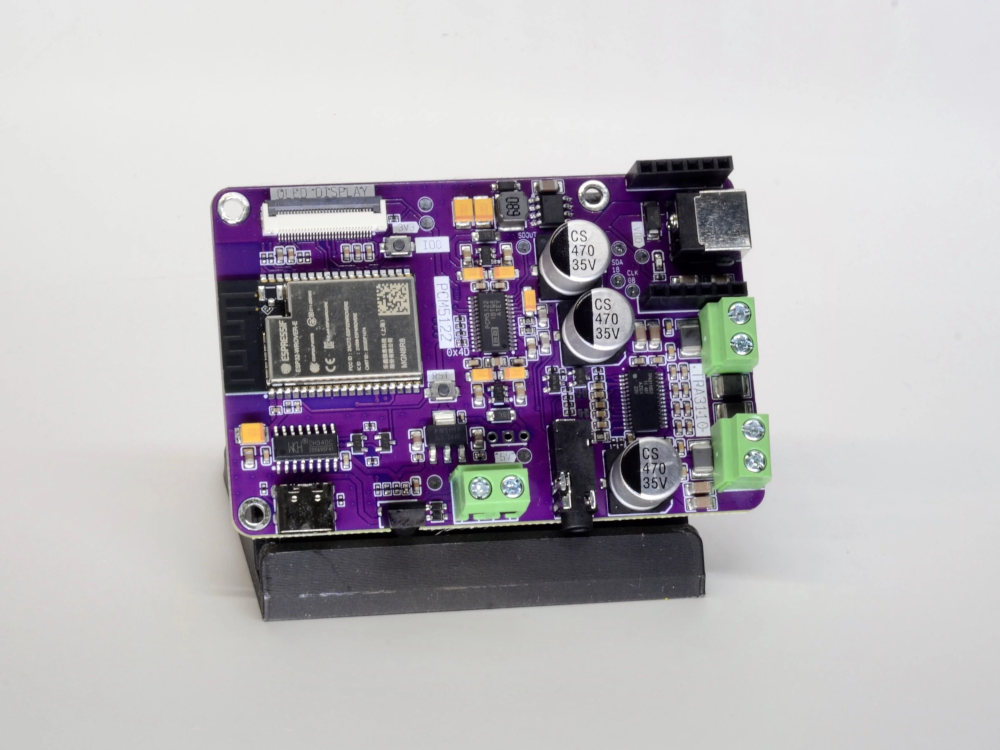

# Sonocotta Amped-ESP32-S3-Plus (rev C)



An all-in-one audio board: **ESP32-S3 + a PCM5122 DSP DAC + a TPA3110/3128
class-D amplifier** on a single PCB, so it drives passive speakers directly — no
external DAC to wire. This is the `esp32s3-amped-plus` board profile
(`boards/board_esp32s3_amped_plus.h`).

> **Revision matters.** This sheet is for **rev C** (schematic title *"Amped
> ESP32 S3 Plus (PCM5122 + TPA3110)"*, dated 2026-01). Rev C carries a schematic
> note — **"New pinout for I2C! No DAC_EN, only AMP_EN"** — so the pin map and
> mute wiring below differ from earlier Amped revisions. Confirm your board's
> silkscreen says **REV C** before trusting these pins.

## Chip / module

- SoC: **ESP32-S3-WROOM-1** — dual-core Xtensa LX7 @ 240 MHz, Wi-Fi b/g/n + BLE 5
- Flash: **8 MB** (quad SPI, internal). The rev-C schematic marks the module
  *"N16R8"* (16 MB), but the shipping board reports **8 MB** (`esptool flash_id`
  / the boot log) and Sonocotta's own ESPHome build uses 8 MB — flashing a 16 MB
  image boot-loops (*"Detected size smaller than the binary image header"*).
- PSRAM: **8 MB** embedded **octal** — comfortably over the ensemble
  player minimum (players are PSRAM-only; see
  [`docs/developer/esp32.md`](../../docs/developer/esp32.md) §3.1)
- USB: native USB-Serial-JTAG over USB-C (the only USB port; flashing + console).
  The board's "USB-to-serial bridge" block is just the USB-C connector + CC/ESD;
  the data lines land on the S3's native USB (GPIO19/20), so it flashes exactly
  like the Super Mini / S3-Zero.
- Reserved: **GPIO26–37** (internal quad flash + the module's octal PSRAM) — not
  broken out, never reuse. Strapping: GPIO0/3/45/46.

## Audio chain

- **DAC:** TI **PCM5122** — I2C-controlled DSP DAC (address **0x4D** on
  SDA=GPIO18 / SCL=GPIO8), fed I2S. Runs **MCLK-less** (its internal PLL derives
  the system clock from BCK).
- **Amp:** TI **TPA3110** (some batches TPA3128), class-D, driven from the DAC's
  line-level output to the speaker terminals.
- **Mute wiring (rev C):** the amp is un-muted by an active-high **AMP_EN** pin on
  **GPIO17**. The PCM5122's own soft-mute (XSMT) is **hardwired asserted-off on
  the PCB** — that is the "No DAC_EN" note — so there is no DAC-enable GPIO; the
  DAC self-un-mutes and the amp-enable is the only mute control.

## Confirmed GPIO map (rev C)

| Function | GPIO | Notes |
|----------|------|-------|
| I2S BCLK | 14 | → PCM5122 BCK |
| I2S LRCK / WS | 15 | → PCM5122 LRCK |
| I2S DOUT | 16 | → PCM5122 DIN |
| I2S MCLK | — | none; PCM5122 internal PLL |
| I2C SDA / SCL | 18 / 8 | PCM5122 @ 0x4D (not used by firmware yet) |
| **AMP_EN** (amp un-mute) | **17** | drive **HIGH** for sound; kept always-on |
| RGB LED (WS2812) | 21 | status LED |
| IR receiver | 7 | not used by firmware |
| SPI (OLED) | 11 / 12 / 13 + 38 / 47 / 48 | optional display |
| Ethernet (W5500) | 5 / 6 / 10 | optional wired-LAN module |

Source: the rev-C schematic plus Sonocotta's own ESPHome / Squeezelite configs
(`dac_config: bck=14,ws=15,do=16,sda=18,scl=8,i2c=77`; `set_GPIO: 7=ir,17=amp`)
at <https://github.com/sonocotta/esp32-audio-dock>.

## Use as an ensemble player

Build and flash:

```sh
cd esp32
./build.sh esp32s3-amped-plus            # merged image in build-esp32s3-amped-plus/
./build.sh esp32s3-amped-plus flash      # build + flash over USB
```

- The profile drives **GPIO17 high at boot** to un-mute the amp and leaves it
  high (the TPA3110 pops on shutdown, so it stays on and quiet is done in
  software — matching Sonocotta's ESPHome `ALWAYS_ON`). All pins are
  re-provisionable over the USB console (`amp_en`, `i2s_*`, `led`, …).
- **The PCM5122 needs an I2C init to make any sound.** It's strapped in software
  (I2C) control mode and runs MCLK-less, so it stays silent (line-out *and* amp)
  until its PLL is pointed at BCK. `dac=1` makes `player_init` run `pcm5122.c`'s
  minimal init over I2C (SDA=18/SCL=8, addr 0x4D): PLL ref = BCK, un-standby,
  un-mute, 0 dB digital volume. The boot log shows `pcm5122: PCM5122 @ 0x4D
  initialised …`. **Playback volume is still software** (`volume.c`) with the DAC
  at unity; hardware (I2C/DSP) volume is a future option.
- **No APLL** on the S3's I2S, so the node advertises `queue=0` and rides crystal
  drift via the sample-insert/drop servo — same as the other S3 boards.
- **No rotary encoder** is fitted (the board uses an IR remote, which the firmware
  doesn't drive yet). The profile's encoder defaults are just free, broken-out
  pads so config validation passes.

## Notes

- If a unit boots with `pcm5122: no ACK from PCM5122 @ 0x4D …` in the log, the
  control I2C isn't reaching the DAC — check the `i2c_sda` / `i2c_scl` provisioned
  pins (defaults 18 / 8) and the board revision's I2C wiring.
- First flash on an S3 may need download mode: hold **BOOT**, tap **RST**, release
  **BOOT**, then flash.

## Sources

- Sonocotta Amped-ESP32 product page — https://sonocotta.com/amped-esp32/
- Board repo (schematics, ESPHome + Squeezelite configs) —
  https://github.com/sonocotta/esp32-audio-dock
- rev-C schematic —
  `hardware/8-amped-esp32-plus/rev-c/2602-amped-esp32s3-plus-c-schematic.pdf`
