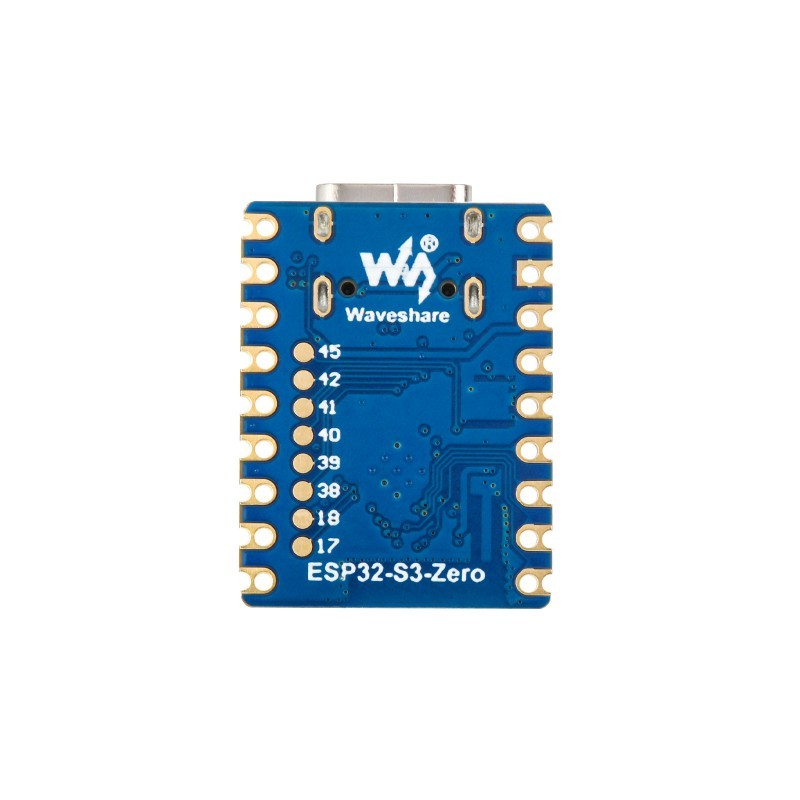
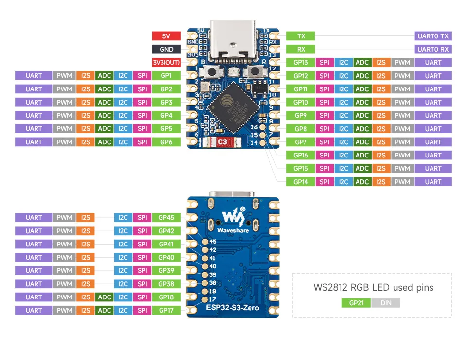
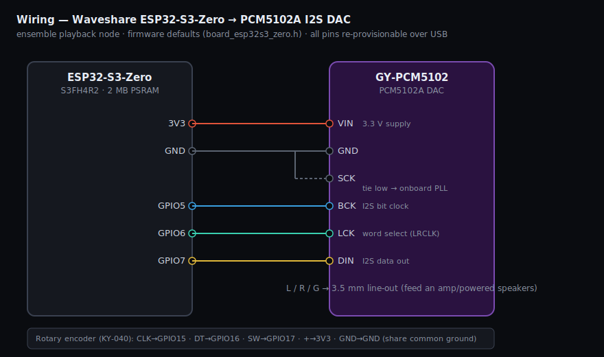

# Waveshare ESP32-S3-Zero

A 23.5 × 18 mm USB-C "Zero" board — castellated + through-hole pads down each
long edge, a ceramic antenna, an onboard WS2812 RGB LED on **GPIO21**, and BOOT
+ RST buttons. Native USB-Serial-JTAG over the USB-C port (no external UART
bridge), so it flashes/provisions exactly like the ESP32-S3 Super Mini — the two
boards differ only in the LED pin (GPIO21 here, GPIO48 on the Super Mini).

> **This is the PSRAM variant.** Waveshare ships the S3-Zero as the
> **ESP32-S3FH4R2** (4 MB quad flash + **2 MB embedded quad PSRAM**), which is
> what ondaire players require (see
> [`docs/developer/esp32.md`](../../docs/developer/esp32.md) §3.1 — players are
> PSRAM-only). Confirm with `esptool.py flash_id` (looks for
> `Features: ... Embedded PSRAM 2MB`).

## Chip / module

- SoC: ESP32-S3 (dual-core Xtensa LX7 @ 240 MHz, Wi-Fi b/g/n + BLE 5)
- Flash: 4 MB (quad SPI, internal)
- PSRAM: **2 MB** embedded quad (S3FH4R2, 3.3 V)
- SRAM: 512 KB; ROM 384 KB
- Native USB-OTG / USB-Serial-JTAG, 4× SPI, 2× I2C, 3× UART, 2× I2S, RMT,
  LED PWM, 2× 12-bit ADC, capacitive touch
- Ceramic antenna; tiny 23.5 × 18 mm footprint

## Header pinout

Two long edges of castellated + through-hole pads, plus a small group of pads on
the underside near the USB connector. The board breaks out **GPIO1–18** on one
edge and **GPIO38–42, 45** plus the UART (GPIO43/44) and remaining pins on the
other edge / underside. GPIO19/20 are **not** broken out — they are the native
USB D-/D+ on the USB-C connector. GPIO26–32 (internal quad flash) are likewise
not exposed. **GPIO21** drives the onboard WS2812 and is not meant for app I/O.

### Edge A (GPIO1–18)

| Pin label | GPIO | Notable alternate functions |
|-----------|------|------------------------------|
| 5V        | —    | 5 V (VBUS / VIN) |
| GND       | —    | Ground |
| 3V3       | —    | 3.3 V output |
| IO1       | 1    | ADC1_CH0, TOUCH1, RTC |
| IO2       | 2    | ADC1_CH1, TOUCH2, RTC |
| IO3       | 3    | ADC1_CH2, TOUCH3, **strapping** (JTAG src select) |
| IO4       | 4    | ADC1_CH3, TOUCH4, RTC |
| IO5       | 5    | ADC1_CH4, TOUCH5, RTC |
| IO6       | 6    | ADC1_CH5, TOUCH6, RTC |
| IO7       | 7    | ADC1_CH6, TOUCH7, RTC |
| IO8       | 8    | ADC1_CH7, TOUCH8, SUBSPICS1, RTC |
| IO9       | 9    | ADC1_CH8, FSPIHD, RTC |
| IO10      | 10   | ADC1_CH9, FSPICS0, RTC |
| IO11      | 11   | ADC2_CH0, FSPID, RTC |
| IO12      | 12   | ADC2_CH1, FSPICLK, RTC |
| IO13      | 13   | ADC2_CH2, FSPIQ, RTC |
| IO14      | 14   | ADC2_CH3, FSPIWP, RTC |
| IO15      | 15   | ADC2_CH4, U0RTS, XTAL_32K_P, RTC |
| IO16      | 16   | ADC2_CH5, U0CTS, XTAL_32K_N, RTC |
| IO17      | 17   | ADC2_CH6, U1TXD, RTC |
| IO18      | 18   | ADC2_CH7, U1RXD, CLK_OUT3, RTC |

### Edge B (GPIO38–45 + UART)

| Pin label | GPIO | Notable alternate functions |
|-----------|------|------------------------------|
| IO38      | 38   | FSPIWP |
| IO39      | 39   | MTCK (JTAG), CLK_OUT3 |
| IO40      | 40   | MTDO (JTAG), CLK_OUT2 |
| IO41      | 41   | MTDI (JTAG), CLK_OUT1 |
| IO42      | 42   | MTMS (JTAG) |
| TX        | 43   | U0TXD — default console UART TX |
| RX        | 44   | U0RXD — default console UART RX |
| IO45      | 45   | **strapping** (VDD_SPI voltage select) |

GPIO21 (onboard WS2812 RGB LED) is wired internally; some board revisions also
break it out to a pad — leave it for the status LED.

## Strapping pins — handle with care

Sampled at reset; they decide boot mode / flash voltage. Avoid driving them at
power-up and never hard-tie without knowing the required level:

- **GPIO0** — BOOT button. Low at reset = download mode; high/float = normal.
- **GPIO3** — JTAG signal source / boot config; leave floating unless needed.
- **GPIO45** — VDD_SPI (flash/PSRAM voltage) select. Must match the module.
- **GPIO46** — boot-mode / ROM-log strap (not broken out).

## SPI-flash / PSRAM pins — do NOT reuse

Internal quad flash + embedded PSRAM use **GPIO26–GPIO32**; these are not on the
pads and must never be repurposed.

## USB

- **GPIO19 = USB D-**, **GPIO20 = USB D+** (native USB-Serial-JTAG) wired to the
  USB-C connector — this is the only USB port and the flashing/console path.
- There is no separate UART bridge chip; the broken-out TX/RX (GPIO43/44) are
  plain UART0 you can repurpose.

## Use as an ondaire player

- **DAC wiring** matches the DevKitC and Super Mini profiles exactly — see
  [`pcm5102a-dac.md`](pcm5102a-dac.md). Default pins (board profile
  `boards/board_esp32s3_zero.h`, all re-provisionable over USB):

  

  | Function | GPIO |
  |----------|------|
  | I2S BCK / LCK / DIN | 5 / 6 / 7 |
  | I2S MCLK | none (tie DAC SCK → GND) |
  | Encoder CLK / DT / SW | 15 / 16 / 17 |
  | Status LED (WS2812) | 21 |

  All of these are safe, broken-out GPIOs on the S3-Zero.
- **No APLL** (the S3's I2S has none), so the node advertises `queue=0` and rides
  crystal drift — same as the DevKitC and Super Mini.
- **PSRAM is mandatory** for a real player; the S3-Zero ships with 2 MB, so it is
  a viable player out of the box.

## Notes

- Hold BOOT, tap RST, release BOOT to force download mode if auto-reset flashing
  fails.
- ADC2 channels are unusable while Wi-Fi is active; prefer ADC1 (GPIO1–10).
- GPIO43/44 carry the boot log by default — sharing them with a peripheral will
  spew console output onto your bus.

## Sources

- https://www.waveshare.com/wiki/ESP32-S3-Zero
- https://www.espboards.dev/esp32/esp32-s3-zero/
- https://docs.espressif.com/projects/esp-idf/en/latest/esp32s3/api-reference/peripherals/gpio.html
