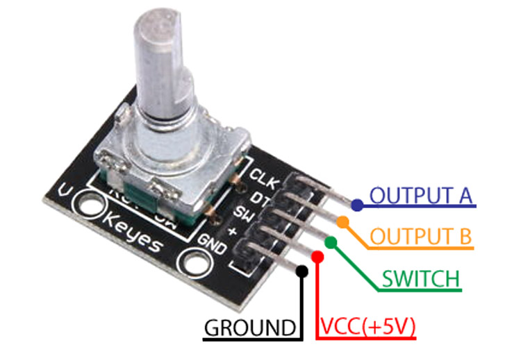

# KY-040 / HW-040 Rotary Encoder

Incremental quadrature rotary encoder module with an integrated push-button
(press the shaft). The KY-040 carries onboard pull-up resistors; the bare
HW-040 variant is the same encoder but may omit/relocate the pull-ups.

## Pinout

| Pin | Name | Function |
|-----|------|----------|
| CLK | Output A | Quadrature channel A (a.k.a. "A"). One of the two phase outputs. |
| DT  | Output B | Quadrature channel B (a.k.a. "B"). The second phase output, 90° out of phase with CLK. |
| SW  | Switch | Push-button (shaft press). Pulled high; goes **low when pressed**. |
| +   | VCC | Supply, 3.3 V–5 V. Powers the pull-ups. |
| GND | Ground | Ground. |

## Quadrature direction

CLK and DT are two square waves 90° out of phase. On each detent CLK toggles;
sampling DT at that edge tells you direction:

- **Clockwise:** at a falling edge of CLK, **DT differs from CLK** (DT is high
  while CLK has gone low) → count up.
- **Counter-clockwise:** at a falling edge of CLK, **DT equals CLK** → count
  down.

In practice: detect a change on CLK, then read DT — if `DT != CLK` it's one
direction, if `DT == CLK` it's the other. (Swap CLK/DT wiring to flip the sense
if your "up" turns out backwards.)

## Onboard pull-ups

The KY-040 board includes **10 kΩ pull-up resistors** on CLK and DT (tied to
VCC). The SW line typically does **not** have a board pull-up on all batches —
enable the MCU's internal pull-up on the SW input (and consider an external
0.01–0.1 µF cap to GND for debouncing). The encoder contacts are mechanical and
bounce, so debounce CLK/DT and SW in firmware or with RC filtering.

## Typical wiring to an ESP32

| Encoder pin | ESP32 side |
|-------------|------------|
| +   | 3.3 V |
| GND | GND |
| CLK | any GPIO (interrupt-capable preferred) |
| DT  | any GPIO |
| SW  | any GPIO, enable internal pull-up |

Use 3.3 V (not 5 V) when driving ESP32 inputs directly, since ESP32 GPIOs are
**not 5 V tolerant**.

## Notes

- ~20 detents/revolution is typical; output is relative (incremental), not
  absolute position.
- Mechanical contacts bounce — always debounce. Interrupt-on-change on CLK plus
  reading DT is a common, low-overhead approach.

## Sources

- https://components101.com/modules/KY-04-rotary-encoder-pinout-features-datasheet-working-application-alternative
  (pinout image: https://components101.com/sites/default/files/component_pin/KY-04-Rotary-Encoder-Pinout.jpg)
- https://www.espboards.dev/sensors/ky-040/
- https://www.handsontec.com/dataspecs/module/Rotary%20Encoder.pdf
