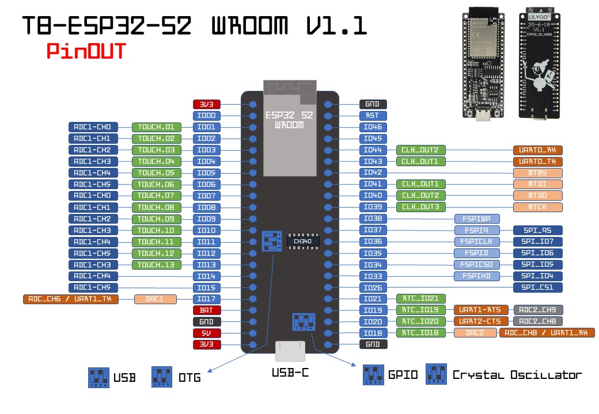

# LilyGo T8-S2 (ESP32-S2-WROOM, dual-DIP variant)

A LilyGo **T8-S2** carrier built around an **Espressif ESP32-S2-WROOM**
module (silkscreen "ESP32-S2-WROOM", 2020 date code). This variant has:

- the **ESP32-S2-WROOM** module (PCB-antenna, 4 MB flash, optional PSRAM)
- **two 4-position DIP switch blocks** silkscreened **"KE 1 2 3 4"** — one near
  the top edge, one near the bottom
- **USB-C** (the S2 has native USB-OTG / USB-Serial-JTAG, so flashing and the
  serial console run over the chip itself)
- **RST** and **BOOT** push-buttons
- **22 header pins per side**
- onboard microSD/TF slot

> The reference image above is the module-level **ESP32-S2-WROOM** pinout (with
> the matching LilyGo T8-S2 board photos top-right). It is the authoritative
> map because the ondaire firmware addresses GPIOs **by number** — pins are
> re-provisionable, and the GPIO↔function mapping is fixed by the
> ESP32-S2-WROOM module, *independent of the LilyGo carrier's physical header
> order*. Wire by the GPIO number printed on the header silkscreen.

## Chip / module

- SoC: ESP32-S2 (single-core Xtensa LX7 @ 240 MHz, Wi-Fi b/g/n, **no Bluetooth**)
- Module: ESP32-S2-WROOM (4 MB SPI flash; some boards add 2 MB PSRAM)
- 43 GPIOs, native USB-OTG, 3x SPI, 2x I2C, 2x UART, 1x I2S, RMT, LED PWM,
  2x 13-bit ADC, 14x capacitive touch, DAC1/DAC2, LCD interface
- microSD (SPI) on the bottom edge

## ESP32-S2-WROOM module GPIO map

This is the real mapping (chip/module level). The LilyGo carrier just routes
these to headers — the GPIO numbers do not change.

| GPIO | ADC / DAC | Notable functions | Notes |
|------|-----------|-------------------|-------|
| 0    | —         | BOOT button, RTC  | **strapping** (boot mode) — don't drive at reset |
| 1    | ADC1_CH0  | TOUCH1, RTC       | free |
| 2    | ADC1_CH1  | TOUCH2, RTC       | free |
| 3    | ADC1_CH2  | TOUCH3, RTC       | free |
| 4    | ADC1_CH3  | TOUCH4, RTC       | free — **default encoder CLK** |
| 5    | ADC1_CH4  | TOUCH5, RTC       | free — **default encoder DT** |
| 6    | ADC1_CH5  | TOUCH6, RTC       | free — **default encoder SW** |
| 7    | ADC1_CH6  | TOUCH7, RTC       | free |
| 8    | ADC1_CH7  | TOUCH8, RTC       | free |
| 9    | ADC1_CH8  | TOUCH9, RTC       | free |
| 10   | ADC1_CH9  | TOUCH10, RTC      | free |
| 11   | ADC2_CH0  | TOUCH11, RTC      | free (ADC2 unusable w/ Wi-Fi) |
| 12   | ADC2_CH1  | TOUCH12, RTC      | free (ADC2 unusable w/ Wi-Fi) |
| 13   | ADC2_CH2  | TOUCH13, RTC      | free (ADC2 unusable w/ Wi-Fi) |
| 14   | ADC2_CH3  | TOUCH14, RTC      | free (ADC2 unusable w/ Wi-Fi) |
| 15   | ADC2_CH4  | RTC               | free |
| 16   | ADC2_CH5  | RTC               | free |
| 17   | ADC2_CH6  | **DAC1**, RTC     | true analog out |
| 18   | ADC2_CH7  | **DAC2**, CLK_OUT3, RTC | true analog out |
| 19   | ADC2_CH8  | **USB D-**, U1CTS, RTC | reserved for native USB |
| 20   | ADC2_CH9  | **USB D+**, U1RTS, RTC | reserved for native USB |
| 21   | —         | RTC               | free |
| 26–32| —         | SPI-flash / PSRAM | **internal flash bus — do NOT reuse** |
| 33   | —         | FSPIHD, SPIIO4    | free (external flexible-SPI) |
| 34   | —         | FSPICS0, SPIIO5   | free (external flexible-SPI) |
| 35   | —         | FSPID, SPIIO6     | free — **default I2S LCK** |
| 36   | —         | FSPICLK, SPIIO7   | free — **default I2S BCK** |
| 37   | —         | FSPIQ, SPIDQS     | free — **default I2S DIN** |
| 38   | —         | FSPIWP            | free |
| 39   | —         | MTCK (JTAG), CLK_OUT3 | free |
| 40   | —         | MTDO (JTAG), CLK_OUT2 | free |
| 41   | —         | MTDI (JTAG), CLK_OUT1 | free |
| 42   | —         | MTMS (JTAG)       | free |
| 43   | —         | U0TXD             | default console UART TX |
| 44   | —         | U0RXD             | default console UART RX |
| 45   | —         | VDD_SPI select    | **strapping** (flash/PSRAM voltage) |
| 46   | —         | —                 | **strapping**, input-only, no pull |

### Pins to respect

- **Strapping pins GPIO0 / GPIO45 / GPIO46** — sampled at reset. GPIO0 = BOOT
  (low at reset → download mode, wired to the BOOT button); GPIO45 selects
  VDD_SPI flash/PSRAM voltage; GPIO46 is input-only with no internal pull.
  Don't drive these at power-up unless you intend to change boot behaviour.
- **USB D-/D+ = GPIO19 / GPIO20** — wired to the USB-C connector for native
  USB-OTG / USB-Serial-JTAG. Leave them for USB.
- **SPI-flash GPIO26–GPIO32** — the module's internal flash (and PSRAM) bus.
  Not broken out, never repurpose.
- **GPIO35 / GPIO36 / GPIO37** — free general-purpose pins; these are the
  firmware's default I2S pins.
- **GPIO4 / GPIO5 / GPIO6** — free; the firmware's default encoder pins.
- **GPIO17 / GPIO18** — the two DACs (true analog out).

## DIP switches (KE 1-4)

Per the official T8-ESP32-S2 V1.1 pinout legend, the two 4-position "KE 1 2 3 4"
DIP blocks are **signal-routing selectors** for four things:

**`USB` · `OTG` · `GPIO` · `Crystal Oscillator`**

They connect/disconnect the **shared pins** — the USB data lines
(**GPIO19 = D-, GPIO20 = D+**) and the 32.768 kHz RTC-crystal pins — to those
functions. They do **not** renumber GPIOs, and they do **not** touch the pins
this firmware uses (I2S GPIO35/36/37, encoder GPIO4/5/6).

**Correct setting for an ondaire node** (flashed + provisioned over native USB-C):

| Function | Set to | Why |
|----------|--------|-----|
| USB  | **on / connected** | GPIO19/20 → USB-C: needed to flash + run the JSON console |
| OTG  | **on / connected** | native USB-OTG / USB-Serial-JTAG, same reason |
| GPIO | **off** | this re-routes the USB pins to plain GPIO and breaks USB — leave off |
| Crystal Oscillator | don't care | the firmware uses `esp_timer` (main clock), not the 32 kHz RTC crystal |

Practical check: if the board **enumerates over USB-C when you plug it in**
(a serial port appears / ESP Web Tools sees it), the switches are already
correct — don't change them. The exact per-switch up/down pattern is silkscreened
in the four DIP icons along the bottom edge of the board's own pinout.

## How to wire on THIS board

Connect peripherals by the **GPIO number printed on the header silkscreen** —
the physical order of pins on the LilyGo carrier is irrelevant to the firmware.
The firmware defaults are all valid, non-strapping, non-USB, non-flash S2
GPIOs, so they work regardless of the carrier's header layout:

| Function | Default GPIO |
|----------|--------------|
| I2S BCK (bit clock)  | **GPIO36** |
| I2S LCK (word clock) | **GPIO35** |
| I2S DIN (data)       | **GPIO37** |
| Encoder CLK          | **GPIO4**  |
| Encoder DT           | **GPIO5**  |
| Encoder SW           | **GPIO6**  |

Find the header pad labelled with that GPIO number and wire to it. If a given
pad is awkward to reach on your unit, any other free GPIO from the table above
works too — the pins are re-provisionable in the firmware config.

## Notes

- ESP32-S2 has **no Bluetooth** — Wi-Fi only.
- ADC2 (GPIO11–20) conflicts with Wi-Fi; use ADC1 (GPIO1–10) for analog reads.
- True analog out available on **DAC1 = GPIO17** and **DAC2 = GPIO18**.
- Flash over the USB-C port; native USB-Serial-JTAG handles it (no UART bridge).

## Sources

- https://github.com/Xinyuan-LilyGO/ESP32_S2/issues/5
  (ESP32-S2-WROOM front pinout image used above:
  https://user-images.githubusercontent.com/93054078/215358310-0264fb19-63f0-47d0-8cfc-b291aa369b50.jpg)
- https://github.com/Xinyuan-LilyGO/ESP32_S2 (T8-S2 board files / schematic)
- https://www.espressif.com/sites/default/files/documentation/esp32-s2-wroom_esp32-s2-wroom-i_datasheet_en.pdf
  (ESP32-S2-WROOM module datasheet — authoritative pin definitions)
- https://docs.espressif.com/projects/esp-idf/en/latest/esp32s2/hw-reference/index.html
