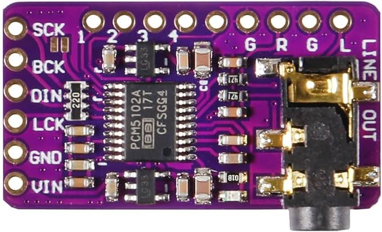

# PCM5102A I2S DAC — "GY-PCM5102" (purple board)

The common purple **GY-PCM5102** breakout around the TI **PCM5102A** stereo
DAC. It accepts standard I2S and drives a 3.5 mm stereo line-out jack. The
PCM5102A has an **internal PLL**, so it can derive its own system clock from
BCK alone — you do **not** need to supply MCLK/SCK in normal I2S-slave use.

## Input edge header (left side)

| Pin | Name | Function |
|-----|------|----------|
| SCK | System clock | Master/system clock input. With the onboard PLL you normally **tie SCK to GND** (the chip then generates its clock from BCK). Leaving it floating can cause noise — ground it. |
| BCK | Bit clock | I2S bit clock (a.k.a. BCLK / SCLK). |
| DIN | Data in | I2S serial audio data (a.k.a. SD / SDATA / DOUT-from-MCU). |
| LCK | LR word clock | Left/right word-select clock (a.k.a. LRCLK / WS / FS). |
| GND | Ground | Power/signal ground. |
| VIN | Power | 3.3 V–5 V supply; an onboard LDO feeds the DAC. |

## Output (right side)

| Pin | Name | Function |
|-----|------|----------|
| L | Left | Left analog line-out (also on the 3.5 mm jack tip). |
| R | Right | Right analog line-out (also on the 3.5 mm jack ring). |
| G | Ground | Analog/output ground (jack sleeve). |

The silkscreen order on this board reads **G R G L** along the right edge; the
two grounds are common.

## Config jumper pads (back of board): H1L–H4L

Four solder-jumper pads tie the PCM5102A mode pins to either 3.3 V (H) or GND
(L). Most vendors preset them to sensible defaults; the corresponding chip pins
are:

| Pad | Chip pin | Function | Default / recommended |
|-----|----------|----------|------------------------|
| H1L | FLT  | Digital filter response | **Low = normal latency** FIR (default). High = low-latency filter. |
| H2L | DEMP | De-emphasis (for 44.1 kHz pre-emphasised material) | **Low = off** (default; leave off for modern audio). |
| H3L | XSMT | Soft-mute control | **Tie High to un-mute / enable output.** Low = muted. This pad is the one that most often needs to be set High for sound. |
| H4L | FMT  | Audio data format | **Low = I2S** (default). High = left-justified. Keep **I2S**. |

Notes on the labels: different batches silkscreen these as H1L–H4L (the "L"
meaning "to Low/GND when the pad is bridged"). The mapping above follows the
GY-PCM5102 reference: FLT, DEMP, XSMT(=SCK/soft-mute group), FMT. If your board
is silent, the usual fix is ensuring **XSMT is pulled high** (un-muted) and
**SCK is grounded**.

## Typical wiring to an ESP32 I2S master

| DAC pin | ESP32 side |
|---------|------------|
| VIN | 3.3 V (or 5 V) |
| GND | GND |
| SCK | GND (use internal PLL) |
| BCK | I2S BCLK GPIO |
| LCK | I2S LRCLK / WS GPIO |
| DIN | I2S DOUT GPIO |
| L / R / G | line-level audio out |

## Notes

- This is **line-level out**, not a headphone amp — feed an amplifier or
  powered speakers.
- Format must be standard **I2S** (FMT/H?L low) to match the ESP32 I2S
  peripheral's default mode.
- Keep SCK grounded for the PLL path; only drive SCK if you intentionally
  supply a synchronous MCLK.

## Sources

- https://docs.cirkitdesigner.com/component/1014fa5d-90dc-43eb-b09c-e0fff9e97c99/pcm5102a-i2s-dac
  (board image: https://abacasstorageaccnt.blob.core.windows.net/cirkit/67ae1250-70c8-4487-8700-f9531abad695.png)
- https://todbot.com/blog/2023/05/16/cheap-stereo-line-out-i2s-dac-for-circuitpython-arduino-synths/
- https://www.ti.com/product/PCM5102A (datasheet — FLT/DEMP/XSMT/FMT pin definitions)
- https://manuals.plus/ae/1005010017736427 (GY-PCM5102 module user manual)
