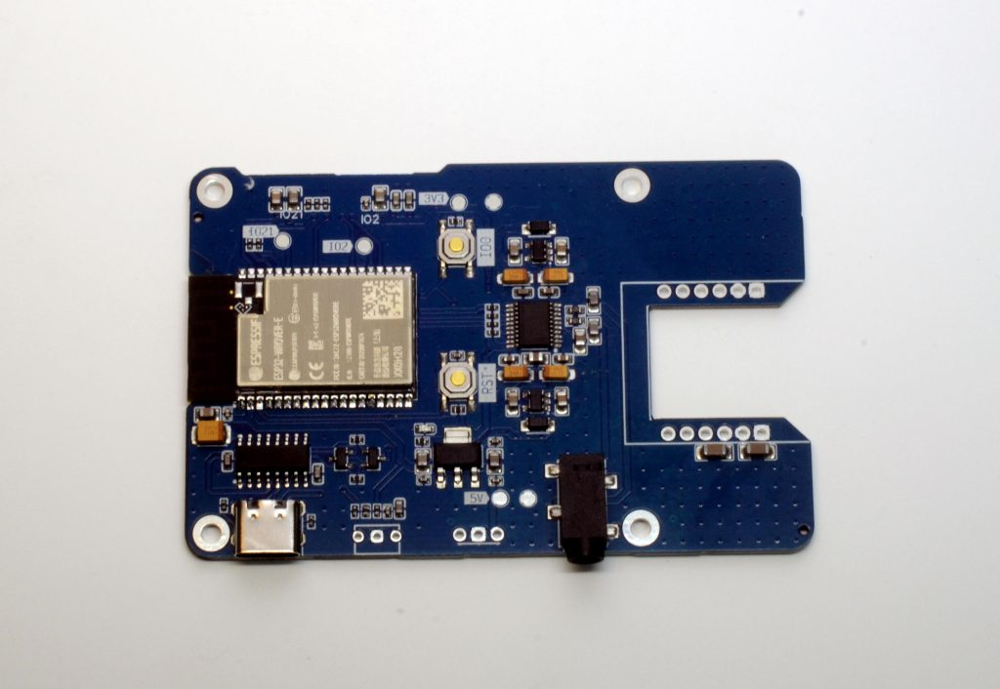
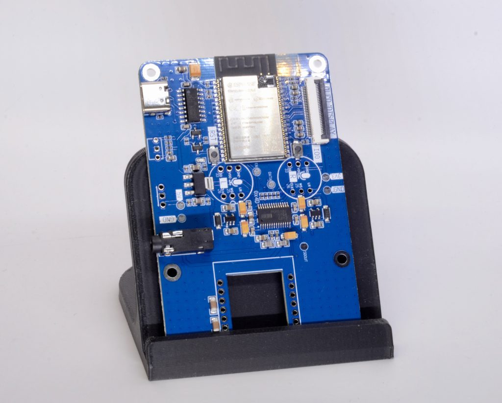
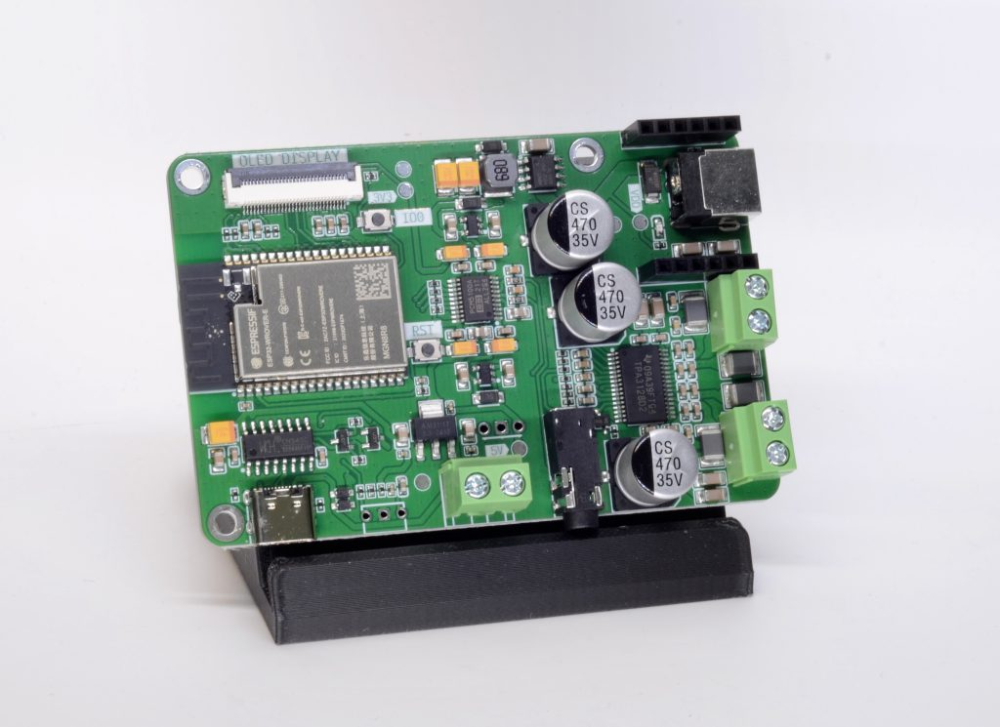
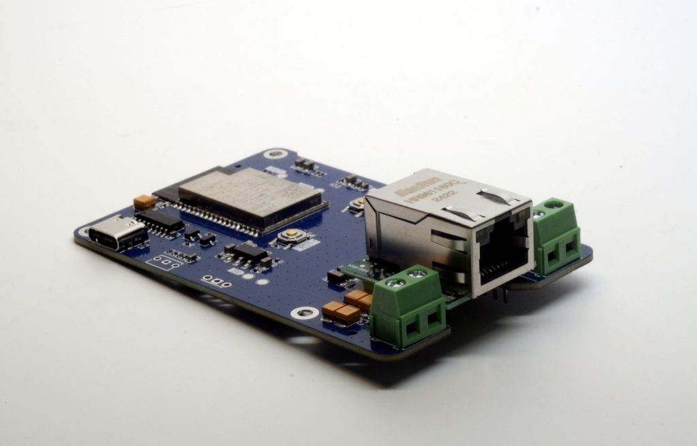
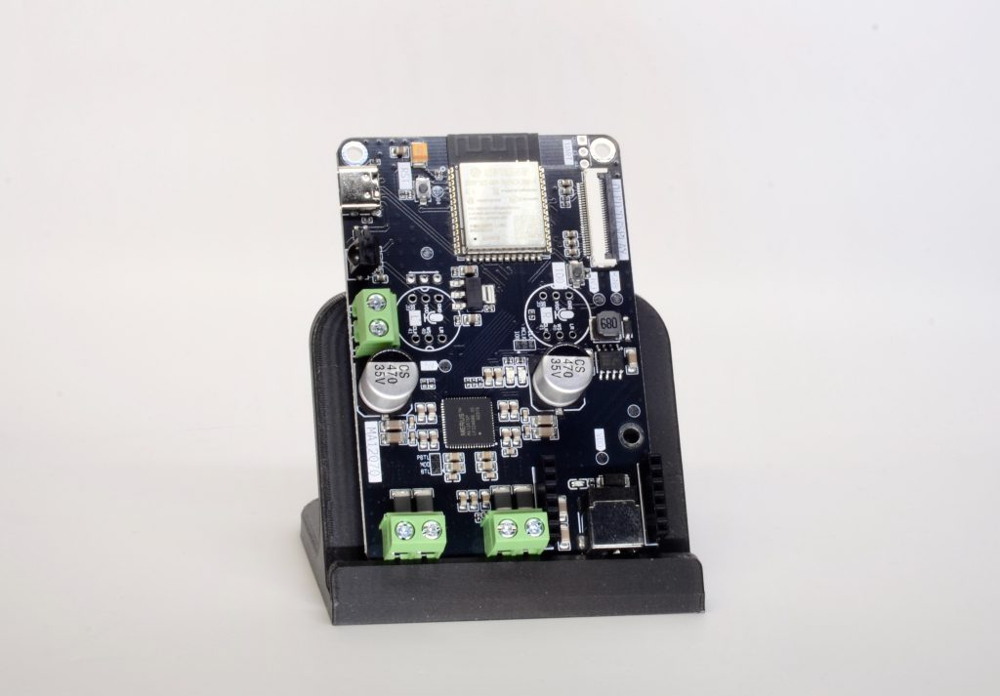
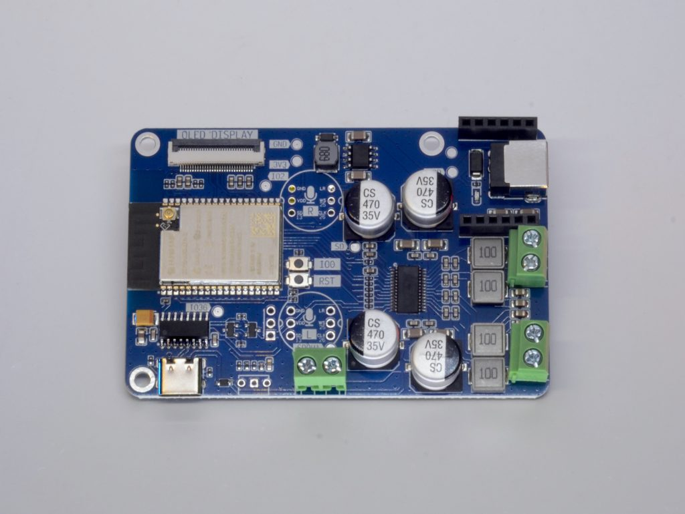
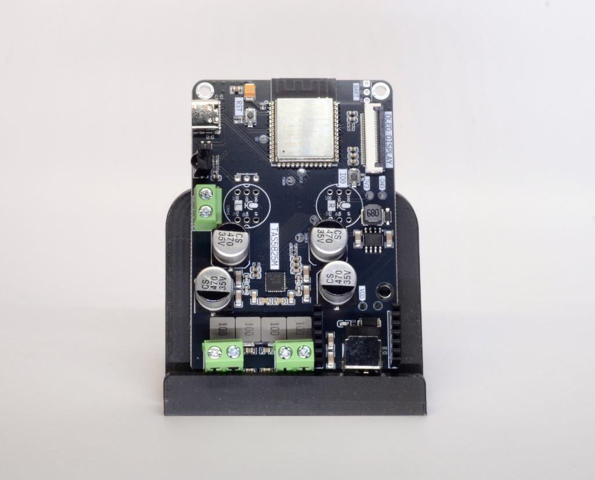

# Sonocotta ESP32-S3 audio-dock family

Sonocotta's [ESP32 audio boards](https://sonocotta.com) share one ESP32-S3 "audio
dock" carrier (ESP32-S3-WROOM-1, 8 MB flash + 8 MB octal PSRAM, native USB-C, a
WS2812 RGB LED, an IR receiver, and optional SPI-OLED + W5500 headers). What
changes between models is the **DAC / amplifier** populated on it. Every model is
a receive-only ondaire player once flashed; all pins and the DAC type are
re-provisionable over USB after flashing, so a wrong default is recoverable.

The [`Amped-ESP32-S3-Plus`](amped-esp32-s3-plus.md) has its own sheet (it was the
first of the family supported). This sheet covers the rest.

> **Testing status.** Only the Amped-ESP32-S3-Plus and the generic S3 dev boards
> have been verified on real hardware. **Every board on this sheet is UNTESTED** —
> the firmware profiles are built pin-map-correct from Sonocotta's published
> schematics and ESPHome configs (`github.com/sonocotta/esp32-audio-dock`) but
> have not been bench-checked. The web flasher badges them **“Untested”** and
> warns on selection. If you have one and it works (or needs a pin fix), please
> report back so the profile can be promoted to tested.

## Shared pin map

Identical across the family (from Sonocotta's ESPHome configs):

| Function | GPIO | Notes |
|----------|------|-------|
| I2S BCLK | 14 | → DAC BCK/SCLK |
| I2S LRCK / WS | 15 | → DAC LRCK |
| I2S DOUT | 16 | → DAC DIN/SDATA |
| I2S MCLK | — | none; every DAC here is MCLK-less (internal PLL from BCK) |
| IR receiver | 7 | not used by firmware yet |
| SPI (OLED) | 11 / 12 / 13 + CS/DC/RST | optional display, not used by firmware |
| Ethernet (W5500) | 5 / 6 / 10 | optional wired-LAN module, not used by firmware |

Per-board differences (I2C pins, DAC address, enable/mute, LED) are in each
section below. **Reserved:** GPIO26–37 (internal flash + octal PSRAM) — never
reuse. Strapping: GPIO0/3/45/46.

The firmware has no rotary encoder mapping for these boards (IR remote is the
intended local control, and IR isn't wired in firmware yet); each profile parks
the encoder defaults on free broken-out pads so config validation passes.

---

## HiFi-ESP32-S3

Line-out only, no amp. Profile `esp32s3-hifi` (`boards/board_esp32s3_hifi.h`).

- **DAC:** TI **PCM5100A** — hardware-strapped (no I2C), MCLK-less. Behaves like
  the PCM5102A boards, so `dac=0` (software volume) drives it with no init.
- **LED:** WS2812 on GPIO9. **No I2C, no amp, no enable pin.**

## HiFi-ESP32-Plus

Line-out only, no amp, but a DSP-capable DAC. Profile `esp32s3-hifi-plus`
(`boards/board_esp32s3_hifi_plus.h`).

- **DAC:** TI **PCM5122** — I2C-controlled DSP DAC (**0x4D** on SDA=**42** /
  SCL=**41**, the rev H1+ pin swap), MCLK-less. `dac=1` → the firmware runs
  `pcm5122.c` (PLL ref = BCK, un-standby, un-mute, 0 dB) or it stays silent.
- **Enable:** DAC enable on **GPIO4** (`dac_en`) — driven HIGH before the I2C init.
- **LED:** WS2812 on GPIO9.

## Amped-ESP32-S3

All-in-one with a simple DAC + amp. Profile `esp32s3-amped`
(`boards/board_esp32s3_amped.h`).

- **DAC:** TI **PCM5100A** (hardware-strapped, MCLK-less, `dac=0`).
- **Amp:** TI **TPA3110/3128**, 2×25 W. Un-muted by **AMP_EN=GPIO17** (driven
  HIGH while audio plays, idle-gated by `player.c`).
- **LED:** WS2812 on GPIO9. No I2C.

## Loud-ESP32-S3

All-in-one, 2×5 W. Profile `esp32s3-loud` (`boards/board_esp32s3_loud.h`).

- **DAC+amp:** two Maxim **MAX98357A** mono I2S DAC+amp chips (one Left, one
  Right) — self-contained, MCLK-less, no I2C, gain/channel strapped in hardware.
  `dac=0`, software volume.
- **Enable:** shared **SD/enable on GPIO17**, handled via `amp_en` (HIGH = on,
  idle-gated).
- **LED:** WS2812 on GPIO9.

## Loud-ESP32-Plus

All-in-one, high power (2×60 W into 4Ω). Profile `esp32s3-loud-plus`
(`boards/board_esp32s3_loud_plus.h`).

- **Amp:** Infineon **MA12070P** — I2C DSP class-D amp (**0x20** on SDA=**8** /
  SCL=**9**). `dac=3` → the firmware runs `ma12070p.c` (I2S format + error-handler
  reset + 0 dB).
- **Enable:** **active-LOW** enable on **GPIO17** (`dac_en`); the driver drives it
  LOW to run the part.
- **Mute:** **GPIO18** (`DEF_MA_MUTE`) — LOW while configuring, HIGH to un-mute.
- **LED:** WS2812 on GPIO21 (GPIO9 is taken by I2C-SCL).

## Louder-ESP32-S3 / Mini

All-in-one DSP amp, 2×32 W into 8Ω. Profile `esp32s3-louder`
(`boards/board_esp32s3_louder.h`). **The Louder-ESP32-Mini uses the same
TAS5805M and pin map — flash the same image.**

- **Amp:** TI **TAS5805M** — I2C DSP class-D amp (**0x2D** on SDA=**8** /
  SCL=**9**), MCLK-less. `dac=2` → the firmware runs `tas58xx.c` (reset, BTL,
  0 dB digital + analog gain, play/un-mute).
- **Enable:** device PDN/enable on **GPIO17** (`dac_en`) — TI power-up timing
  (LOW → 1 ms → HIGH → 5 ms), then held HIGH.
- **LED:** WS2812 on GPIO21 (GPIO9 is taken by I2C-SCL).

## Louder-ESP32-Plus / Pro

All-in-one DSP amp, 2×30 W. Profile `esp32s3-louder-plus`
(`boards/board_esp32s3_louder_plus.h`). **The Louder-ESP32-Pro uses the same
TAS5825M and pin map — flash the same image.**

- **Amp:** TI **TAS5825M** — same `tas58xx.c` init as the TAS5805M; only the I2C
  address differs (**0x4C** on SDA=**8** / SCL=**9**). `dac=2`.
- **Enable:** device PDN/enable on **GPIO17** (`dac_en`), TI power-up timing.
- **LED:** WS2812 on GPIO21.

---

## DAC-type quick reference (`dac=` field)

| `dac` | Part(s) | Control | Boards |
|------:|---------|---------|--------|
| 0 | PCM5100A / PCM5102A / MAX98357A | none (HW-strapped, MCLK-less) | HiFi, Amped, Loud |
| 1 | PCM5122 | I2C (`pcm5122.c`) | HiFi-Plus, Amped-Plus |
| 2 | TAS5805M / TAS5825M | I2C (`tas58xx.c`) | Louder, Louder-Plus |
| 3 | MA12070P | I2C (`ma12070p.c`) | Loud-Plus |

Sources: Sonocotta schematics + ESPHome configs
(`github.com/sonocotta/esp32-audio-dock`, `firmware/esphome/*`), and the TI
TAS5805M/TAS5825M and Infineon MA12070P datasheets. The I2C register init
sequences are distilled to the minimal passthrough set (EQ/DSP coefficient banks
omitted) — see the driver source comments in `esp32/main/`.
